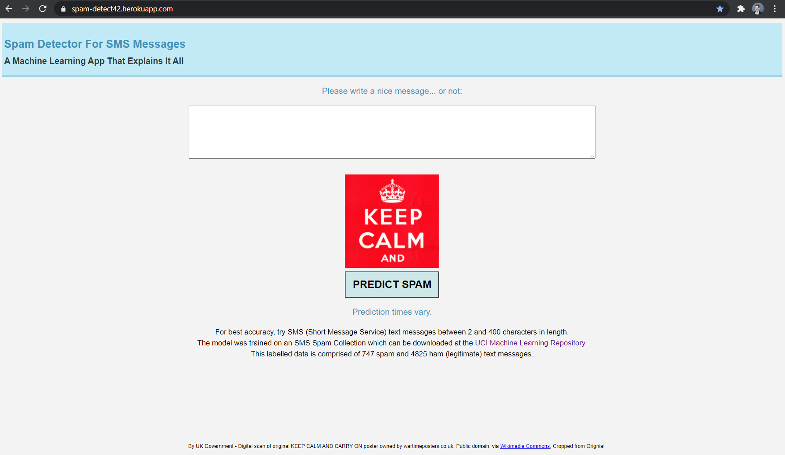
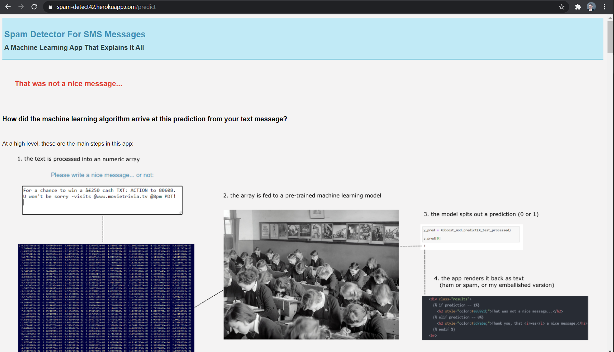

# SMS Spam Detect

## The Problem

Spam detection is an old and continuing problem. I get spam texts every day, and wonder how they got through my spam filter, given that every day I flag them 
and in doing so train what I believe now should be a state-of-the-art, bleeding edge spam detector since I have a Google phone. *Shouldn't the filter catch
what is clearly a spam SMS to me?*

In this project I tackled this old problem using a small corpus (download the SMS Spam Collection from this 
[UCI Machine Learning Repository](https://archive.ics.uci.edu/ml/datasets/sms+spam+collection#) and classical ML algorithms, aiming at explainability. 
I achieve 99% accuracy (see more evaluation metrics and tests in 
[this notebook](https://github.com/BigBangData/NaturalLanguageProcessing/blob/fuji/SMS_SpamDetect/31_EvaluateModels_4.ipynb)) during model evaluation, 
yet since the training data is small I expect this model to generalize poorly, despite all the tests.

So I deploy the model in an app to see how it does in the wild - with unseen data - to fully understand the challenge. 
The app is [spam-detect42](https://spam-detect42.herokuapp.com/).

## The App 

It's a free-hosted app so the loading time might be a minute at first, but prediction should be quick and the results page well worth the effort. 
In it, I offer a detailed look into all that goes behind the scenes to be able to transform a text into a prediction. 

This is meant to demistify machine learning and "A.I." - at least the classical kind (not neural networks which are a bit more of a black box).

Machines are not intelligent. As one of the founders of the field, [Michael I. Jordan](https://people.eecs.berkeley.edu/~jordan/), expertly comments 
in [this Lex Fridman Podcast](https://lexfridman.com/michael-i-jordan/): the I. in A.I. is a misnomer. We have yet to fully comprehend how humans think, 
let alone believe that machines do so. They follow instructions, even if very complex and computationally intensive ones that mimic randomness and choice.

## Business Applications

This app employes both **Natural Language Processing (NLP)** and **Supervised Machine Learning** which are widely applicable to businesses in a variety 
of ways. The proportion of *unstructured text data* in the internet only grows compared to *structured data* such as tabular data. Text data is often 
found in databases sitting around untapped, as front-facing apps continuously capture open text fields with user comments. 

Insights can be extracted from text using NLP and various analytic methods, whether using machine learning or using simpler designs and iterating through solutions.
This project's framework for processing text and for classification can be extended and adapted to any other classification tasks involving textual data.   

## Acknowledgements

This journey into the fields of NLP and ML took months of learning and development of my own understanding of various inner workings of models I never 
ended up deploying. I am indebted to numerous tutorials and blogs I've read and watched along the way. Below is a list in order of most-to-least influential:

- [Data Science Dojo's](https://datasciencedojo.com/) [Introduction To Text Analytics With R](https://www.youtube.com/playlist?list=PLTJTBoU5HOCR5Vkah2Z-AU76ZYsZjGFK6) by [David Langer](https://www.daveondata.com/)
- Aurélien Géron's [Classification Notebook](https://github.com/ageron/handson-ml/blob/master/03_classification.ipynb) 
- Scikit-Learn's [API Docs](https://scikit-learn.org/stable/modules/classes.html)
- Analytics Vidhya's [Introduction to Topic Modeling and Latent Semantic Analysis](https://www.analyticsvidhya.com/blog/2018/10/stepwise-guide-topic-modeling-latent-semantic-analysis/)
- Prof. Steve Brunton's [YouTube lectures on Singular Value Decomposition](https://www.youtube.com/playlist?list=PLMrJAkhIeNNSVjnsviglFoY2nXildDCcv) 
- Prof. Steve Brunton's [Data-Driven Science and Engineering book](https://www.amazon.com/Data-Driven-Science-Engineering-Learning-Dynamical/dp/1108422098) 
- Kevin Arvai's tutorial [Fine Tuning a Classifier in Scikit-Learn](https://towardsdatascience.com/fine-tuning-a-classifier-in-scikit-learn-66e048c21e65)
- Cole Brendel's article [Quickly Compare Multiple Models](https://towardsdatascience.com/quickly-test-multiple-models-a98477476f0)
- Josh Starmer's [StatQuest YouTube channel](https://www.youtube.com/channel/UCtYLUTtgS3k1Fg4y5tAhLbw)

---

